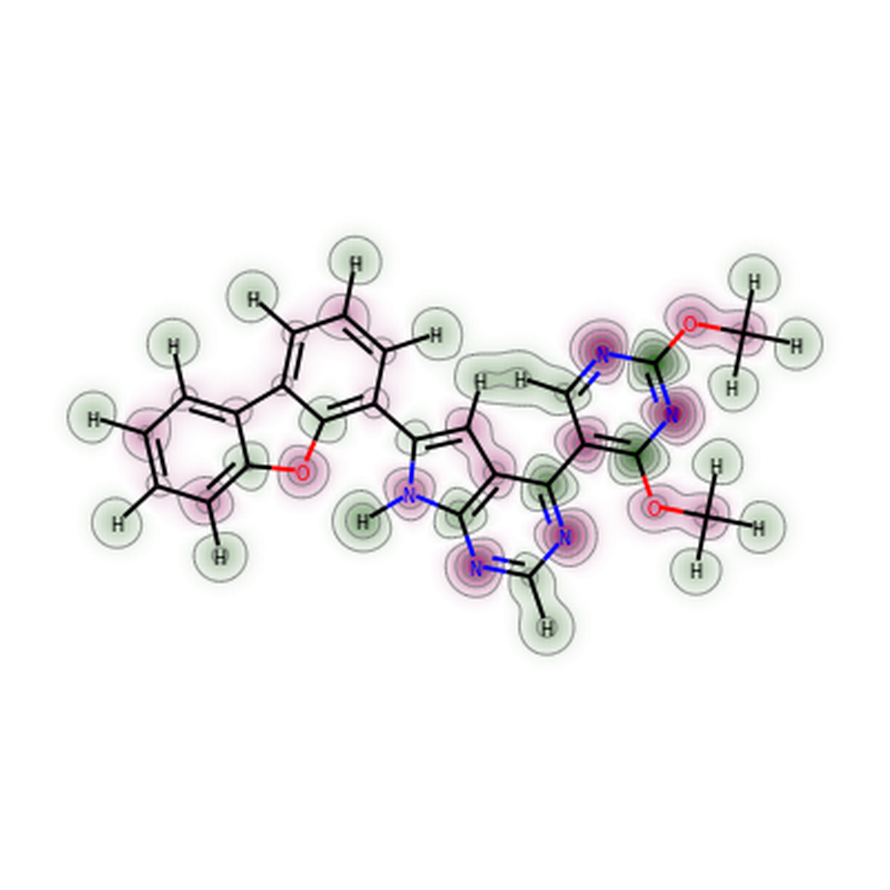
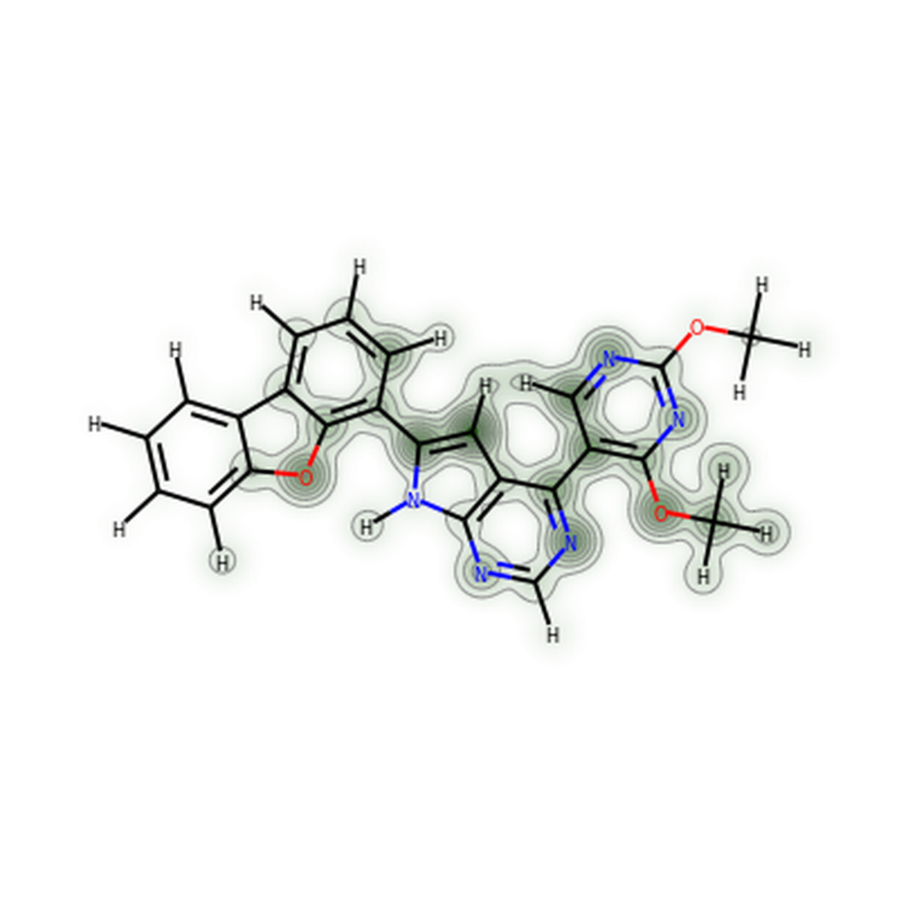

# Compare partial charges between multiple ligand conformations.
#### the same code can be adapted to visualize other atomic properties, like lipophilicity, refraction, donor/acceptor of H-bond, electronegativity, van der Waals attraction/repulsion 
In this tutorial we will exploit the new RDKit's drawing code to visualize the differences in charge distribution induced by
conformational changes of a molecule. To be fair, the conformations in this example come from docking with Glide (100 docking poses)
and the partial charges were calculated individually for each pose on the PM6 semi-empirical QM level of theory, upon some subtle
geometry optimization.


#### 1. Set global variables
```python
mol2_file = "data/compound_stereo1_ion1_tau1.COSMO_PM6.mol2"   # multi-molecule MOL2 file with PM6 partial charges
```
#### 2. Define the necessary functions.

```python
import os
import io
from PIL import Image
import numpy as np
from lib.modlib.pybel import Outputfile, readfile
from rdkit import Chem
from rdkit.Chem import Draw
from rdkit.Chem.Draw import SimilarityMaps
from rdkit.Chem.rdDepictor import Compute2DCoords

def show_png(data):
    bio = io.BytesIO(data)
    img = Image.open(bio)
    img = img.resize((2000, 2000), Image.ANTIALIAS)
    return img

def mol2_to_sdf(mol2_file, sdf_file=None):
    """
        Method to convert a multi-mol2 file to sdf format with an extra property that stores the partial charges.
        It invokes PyBel's mol2 file loader because RDKit's mol2 file loader that not read the partial charges.
    """

    if sdf_file == None:
        sdf_file = os.path.splitext(mol2_file)[0] + ".sdf"
    largeSDfile = Outputfile("sdf", sdf_file, overwrite=True)
    for mymol in readfile("mol2", mol2_file):

        # Add the Molecular (Free) Energy in a new property field in the sdf file
        if 'Comment' in mymol.data.keys() and "Energy:" in mymol.data['Comment']:
            mymol.data["molecular energy"] = float(mymol.data['Comment'].split()[1])
            del mymol.data['Comment']   # if you keep this the energy will be writen under the molname in the sdf
        # Add the Partial Charges of the atoms separated by ',' in a new property field in the sdf file
        charges = [str(a.partialcharge) for a in mymol.atoms]
        if len(set(charges)) > 1:
            mymol.data["partial charge"] = ",".join(charges)

        # Write this molecules with the extra property fields into the sdf file
        largeSDfile.write(mymol)

    largeSDfile.close()

def load_sdf_with_charges(sdf_file):
    """
    This method reads in an sdf file with partial charges as an extra property, and returns an RDKit mol object with
    an extra atomic property named "partial charge".
    """
    # NOTE: for simplicity, because every conformer has different atomic charges and the RDKit MOL object does not
    #       store varying atomic property values for each conformer, I will save each conformer into a separate
    #       RDKit MOL object.
    mol_list = []  # list of RDKit MOL objects (conformers) of the same molecule but with different atomic charges
    suppl = Chem.SDMolSupplier(sdf_file, removeHs=False, sanitize=False)
    for mol in suppl:
        if 'partial charge' in mol.GetPropNames():
            formal_charge = int(np.sum( [float(c) for c in mol.GetProp('partial charge').split(',')] ).round())
            for atom, charge in zip(mol.GetAtoms(), mol.GetProp('partial charge').split(',')):
                # By default the Atom object does not have a property for its partial charge, therefore add one
                atom.SetDoubleProp('partial charge', float(charge)) # property value must be string
                atom.SetFormalCharge(formal_charge)
        mol_list.append(mol)
    return mol_list

sdf_file = os.path.splitext(mol2_file)[0]  + ".sdf"
mol2_to_sdf(mol2_file=mol2_file, sdf_file=sdf_file)
# Load the multi-molecule sdf file with partial charges
mol_list = load_sdf_with_charges(sdf_file)

```

#### 3. First we will compare the partial charges of two distinct conformers.

First conformer:

```python
mol1 = mol_list[52]
Compute2DCoords(mol1)   # add 2D coordinates for better 2D image depiction
charges1 = [a.GetDoubleProp("partial charge") for a in mol1.GetAtoms()]
d = Chem.Draw.MolDraw2DCairo(400, 400)
Chem.Draw.SimilarityMaps.GetSimilarityMapFromWeights(mol1, charges1, draw2d=d)
d.FinishDrawing()
img = show_png(d.GetDrawingText())
img.save("pose1.png", quality=95)
```




Second conformer:

```python
mol2 = mol_list[61]
Compute2DCoords(mol2)   # add 2D coordinates for better 2D image depiction
charges2 = [a.GetDoubleProp("partial charge") for a in mol2.GetAtoms()]
d = Chem.Draw.MolDraw2DCairo(400, 400)
# But draw the charges on the 1st conformer to be able to compare it visually
Chem.Draw.SimilarityMaps.GetSimilarityMapFromWeights(mol1, charges2, draw2d=d)
d.FinishDrawing()
img = show_png(d.GetDrawingText())
img.save("pose2.png")
```


#### 4. Now lets visualize the average (unweighted) partial charges of each atom.

```python
all_pose_charges = []
for mol in mol_list:
    all_pose_charges.append( [a.GetDoubleProp("partial charge") for a in mol.GetAtoms()] )
all_pose_charges = np.array(all_pose_charges)
mean_pose_charges = all_pose_charges.mean(axis=0)
std_pose_charges = all_pose_charges.std(axis=0)

d = Draw.MolDraw2DCairo(400, 400)
SimilarityMaps.GetSimilarityMapFromWeights(mol1,list(mean_pose_charges),draw2d=d)
d.FinishDrawing()
img = show_png(d.GetDrawingText())
img.save("mean_pose.png")
```


#### 5. Finally we can see in which atoms are located most of the differences in the partial charge value by plotting the standard deviations.

```python
d = Draw.MolDraw2DCairo(400, 400)
SimilarityMaps.GetSimilarityMapFromWeights(mol1,list(std_pose_charges),draw2d=d)
d.FinishDrawing()
img = show_png(d.GetDrawingText())
img.save("std_pose.png")
```

